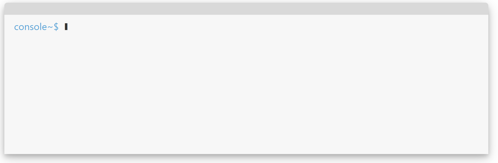

# React Console

**simple-react-console** is a simple console with animated text output. It can be used to get input from your users or to show information. **simple-react-console** started life as a prototype of a puzzle game. It has been pulled out and packaged up in the hope that it may be useful to others. 


## Installation

```powershell
npm install simple-react-console
```

## Demo

You can find a live demo of simple-react-console here {link-to-demo-coming-soon}


## Usage

To add the **simple-react-console** to your site, simply import the component and add to your page. If you don't set a size it will fill the parent object.  Otherwise you can set the dimensions of the console directly. **N.B.** The console will never be wider than the parent component regardless of width set. The width is used to set the max-width of the console. 

```react
import React from 'react';
import Console from 'simple-react-console';

function App() {  
  return (
    <div style={{ maxWidth: '800px', height: '100px' }}>
      <Console/>
    </div>
  );
}

export default App;
```

### setOutput

setOutput allows you to set what you would like to display on the console screen. 

```react
<Console
    setOutput={'Hello World!'}
/>
```


You can pass an array of strings. Doing this will show each string on a new line. 

```react
const output = [
    {string: 'Here is line one - 1.'},
    {string: 'Here is line two - 2.'},
    {string: 'Here is line three - 3.'}
];

return(
    <Console
        setOutput={output}
    />
);
```


### onComplete

onComplete is triggered once a line set with setOutput has finished running 

```react
const [output, setOutput] = 
useState('After this line completes an onComplete event is triggered 0',);
const [output_n, setOutput_n] = useState(0);

const onComplete = () => {
  const n = output_n + 1;
  setOutput_n(n);
  setOutput('After this line completes an onComplete event is triggered ' + n);
}

render(
  <Console
    height="100px"
    setOutput={output}
    onComplete={onComplete}
  />
};
```


### onResponse

onResponse is triggered after a user enters text and presses the return key. An object is returned with: 

```json
{
    value: 'users input as a string',
    id: 'id of output, can be assigned from input'
}
```

 When setting **setOutput** assign an id to the object to have that assigned to the response. The following snippet sets the initial question, gets a response from the user and updates the console with a new message. 

```react
const [output, setOutput] = useState({string: 'Hello, what is your name?', id:'name'});

const onResponse = (response) => {
  console.log('response id: ' + response.id);
  console.log('response value: ' + response.value);

  if(response.id === 'name'){
      setOutput('Hello, ' + response.value);
  }
};

return(
  <Console
    setOutput={output}
    onResponse={onResponse}
  />
);
```


### setOutput - extras

**simple-react-console** allows you to set some restrictions when using setOutput. You can only allow numbers and set a max length. 

```react
const [inputTypes, setInputTypes] = useState({
  string: 'You can only enter numbers in the following input',
  type: 'number',
  id: 'numbers',
});
const inputTypesOnResponse = (response) => {
  switch (response.id) {
    case 'numbers':
      setInputTypes({
        string: 'You can set the max chars - max = 5',
        max: 5,
        id: 'max',
      });
      break;
    case 'max':
      setInputTypes({
        string: 'You can set them both',
        max: 2,
        type: 'number',
        id: 'done',
      });
      break;
    default:
      break;
  }
};

<Console setOutput={inputTypes} height={'200px'} onResponse={inputTypesOnResponse} />
```


### Visuals

 You can modify many of the visual elements of the console. From adding shadows, headers and scrollbars to completely changing the colors. 

##### Header and Shadows

```react
<Console showHeader={true} shadow={true} width="800px" height="250px" />
```

##### Colors

```react
<Console 
  showHeader={true}
  shadow={true}
  width="800px"
  height="250px"
  backgroundColor='#f7f7f7'
  textColor='#333333'
  tagColor="#57A7D9"
/>
```



##### Tags

```react
<Console
  showHeader={true}
  shadow={true}
  width="800px"
  height="250px"
  tag=":>" /*Set the tag used by the console window. Default is  ~$ */
  userTag="Joe" /*changes the console name when the user is inputting*/
  consoleTag="terminal" /*changes the tag used when the console is outputting*/
/>
```

##### Controls

```react
<Console
  setOutput={controlsString}
  showHeader={true}
  shadow={true}
  width="800px"
  height="250px"
  scroll={true} /*If set as true the scroller is shown when required*/
  loop={true} /*If set to true the console will loop through an array of strings*/
  speed={60} /*Sets the speed of the transition for the output of the strings.*/
/>
```

### Passive mode

**simple-react-console** can be used as a animated text window. You can hide the tags and stop users from being able to type in by using the **passive** and **hideTags** options. 

```react
<Console
  showHeader={true}
  shadow={true}
  scroll={true}
  setOutput={aChristmasCarol}
  backgroundColor="#f7f7f7"
  textColor="#333333"
  height={'500px'}
  speed={30}
  passive={true}
  hideTags={true}
/>
```